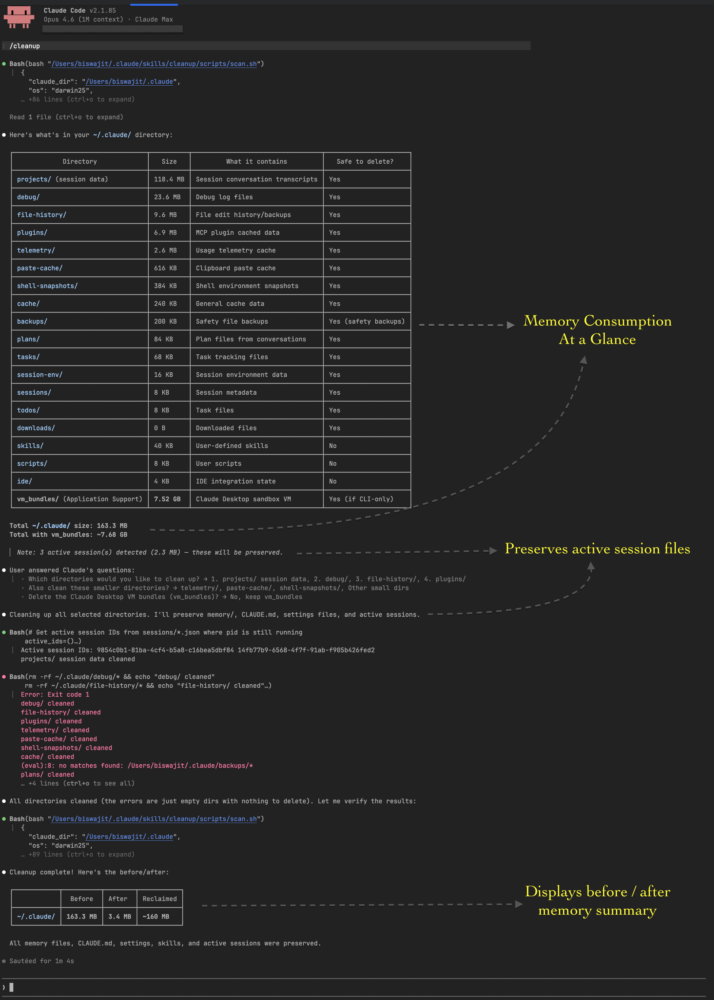

# /cleanup

> Also available as `/cleanup`

Scan and clean up Claude Code's internal data (`~/.claude/`) to reclaim disk space.

## Installation

First, add the marketplace and install the `bix-utils` plugin:

```
/plugin marketplace add IamBiswajitSahoo/ClaudeSkills
/plugin install bix-utils@Biswajit-Claude-Skills
```

## Usage

| Command | Behavior |
|---------|----------|
| `/cleanup` | Scans `~/.claude/`, shows size table, lets you pick which directories to clean |
| `/cleanup -all` | Auto-selects all safe-to-delete directories, asks for confirmation |

## Features

- Cross-platform support (macOS, Linux, WSL, Windows)
- Detects and preserves active sessions
- Protects settings, credentials, memory, and skills
- Shows before/after comparison of disk usage

## Demo


